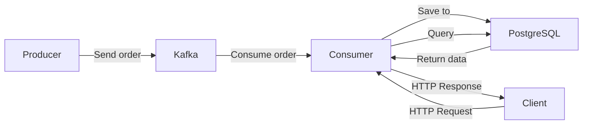

ORDER SERVICE
---------------------------------------------------------------
Используется для отображения данных о заказах.
Получает данные о заказах из очереди Kafka, сохраняет их в базе данных и кэширует в памяти.
Используется веб-интерфейс для поиска и отображения данных заказа по ID. 
---------------------------------------------------------------



--------------------------------------------------------------

```plaintext
WB-TechL0/
├── cmd/
│   ├── cons/           # Consumer service
│   └── prod/           # Producer service
├── internal/
│   ├── api/            # HTTP handlers
│   ├── cache/          # Кэширование
│   ├── config/         # Конфигурация
│   ├── logger/         # Логирование
│   ├── server/         # HTTP server
│   ├── storage/        # Работа с БД
│   └── mocks/          # Моки для тестирования
├── pkg/
│   ├── models/         # Модели данных
│   ├── validator/      # Валидация
│   └── faker/          # Генерация тестовых данных
├── web/
│   └── templates/      # HTML шаблоны
├── docker-compose.yaml
└── init.sql
```

---------------------------------------------------------------

Для установки:
```bash
git clone https://github.com/ArtemKVD/WB-TechL0.git
```

Перед запуском нужно создать .env файл и заполнить его. Пример находится в .env-example

Для запуска:
```bash
docker-compose up --build
```
--------------------------------------------------------------

Для создания и отправки в Kafka тестового заказа

```bash
go run cmd/prod/main.go
```

http://localhost:8080 - Для ввода ID заказа

http://localhost:8080/order?id={id} - Для получения данных о заказе

-------------------------------------------------------------
Стек технологий:
1. Go.
2. Kafka
3. Postgres
4. Docker
5. Docker-compose
